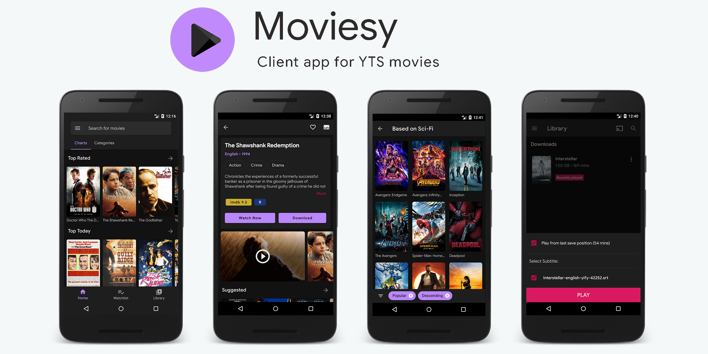

# Moviesy

A **_beautiful_** client for YTS website which also provides built-in _torrent_, _subtitles_ downloader ❤️

## Features

- Clean & **beautiful** UI.
- Built-in _movie_ & _subtitle_ downloader
- Supports torrent **streaming**.
- **Watch** movie using in-built player.
- **Cast** to chromecast devices.
- Lot more...

## Compilation Guide

Since this project involves a private payment system 📃 some of the source files has been ignored. Read this guide in order to compile 🗃 the project.

## Built with 🛠

- [Kotlin](https://kotlinlang.org/) - First class and official programming language for Android development.
- [Coroutines](https://kotlinlang.org/docs/reference/coroutines-overview.html) - For asynchronous and more..
- [Android Architecture Components](https://developer.android.com/topic/libraries/architecture) - Collection of libraries that help you design robust, testable, and maintainable apps.
  - [LiveData](https://developer.android.com/topic/libraries/architecture/livedata) - Data objects that notify views when the underlying database changes.
  - [ViewModel](https://developer.android.com/topic/libraries/architecture/viewmodel) - Stores UI-related data that isn't destroyed on UI changes.
  - [ViewBinding](https://developer.android.com/topic/libraries/view-binding) - Generates a binding class for each XML layout file present in that module and allows you to more easily write code that interacts with views.
  - [Room](https://developer.android.com/topic/libraries/architecture/room) - SQLite object mapping library.
  - [Workmanager](https://developer.android.com/topic/libraries/architecture/workmanager) - WorkManager is an API that makes it easy to schedule deferrable, asynchronous tasks that are expected to run even if the app exits or the device restarts..
- [Dependency Injection](https://developer.android.com/training/dependency-injection) -
  - [Hilt-Dagger](https://dagger.dev/hilt/) - Standard library to incorporate Dagger dependency injection into an Android application.
  - [Hilt-ViewModel](https://developer.android.com/training/dependency-injection/hilt-jetpack) - DI for injecting `ViewModel`.
- [Retrofit](https://square.github.io/retrofit/) - A type-safe HTTP client for Android and Java.
- [Material Components for Android](https://github.com/material-components/material-components-android) - Modular and customizable Material Design UI components for Android.
- [Gradle Kotlin DSL](https://docs.gradle.org/current/userguide/kotlin_dsl.html) - For writing Gradle build scripts using Kotlin.

## Contribute

If you want to contribute to this project, you're always welcome!
See [Contributing Guidelines](CONTRIBUTING.md).

## License

- [The Apache License Version 2.0](https://www.apache.org/licenses/LICENSE-2.0.txt)

```
Copyright 2020 Kaustubh Patange

Licensed under the Apache License, Version 2.0 (the "License");
you may not use this file except in compliance with the License.
You may obtain a copy of the License at

   https://www.apache.org/licenses/LICENSE-2.0

Unless required by applicable law or agreed to in writing, software
distributed under the License is distributed on an "AS IS" BASIS,
WITHOUT WARRANTIES OR CONDITIONS OF ANY KIND, either express or implied.
See the License for the specific language governing permissions and
limitations under the License.
```
