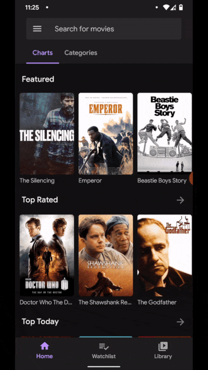

# Shimmer ImageView

**Shimmer ImageView** is an extension over Facebook's standard [shimmer](https://facebook.github.io/shimmer-android) effect library.

> Shimmer effect will be stopped when a bitmap or drawable is set via `setImage()`.



## Download

In your top-level build.gradle file,

```gradle
allprojects {
    repositories {
        ...
        maven { url 'https://jitpack.io' }
    }
}
```

In your app/module build.gradle file add the following dependency.

```gradle
dependencies {
    ...
    implementation 'com.github.KaustubhPatange.Moviesy:shimmer:tag'

    // If build failing
    implementation 'com.facebook.shimmer:shimmer:0.5.0'
    implementation 'androidx.cardview:cardview:1.0.0'
}
```

## Usage

- Add this to your layout xml

```xml
<com.kpstv.shimmer.ShimmerImageView
    android:id="@+id/shimmerImageView"
    android:layout_width="120dp"
    android:layout_height="180dp"
    app:cardCornerRadius="5dp">
    <!-- Inset image will be displayed over shimmer,
         it will be removed once image is set
     -->
    <ImageView
        android:layout_width="50dp"
        android:layout_height="50dp"
        android:layout_gravity="center"
        android:src="@drawable/ic_play_circle"/>
</com.kpstv.shimmer.ShimmerImageView>
```

- Shimmer effect will be enabled by default, it can only be disabled once the Image is set.

```kotlin
// Image loading logic
shimmerImageView.setImage(bitmap)
```

## License

- [The Apache License Version 2.0](https://www.apache.org/licenses/LICENSE-2.0.txt)

```
Copyright 2020 Kaustubh Patange

Licensed under the Apache License, Version 2.0 (the "License");
you may not use this file except in compliance with the License.
You may obtain a copy of the License at

   https://www.apache.org/licenses/LICENSE-2.0

Unless required by applicable law or agreed to in writing, software
distributed under the License is distributed on an "AS IS" BASIS,
WITHOUT WARRANTIES OR CONDITIONS OF ANY KIND, either express or implied.
See the License for the specific language governing permissions and
limitations under the License.
```
